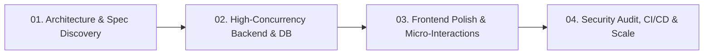

  

<h1 align="center">Hi, I'm Andrew Edward 👋</h1>
<h3 align="center">Principal Systems Architect & Founder at <a href="https://brancodev.com" target="_blank">BRANCO DEV</a></h3>

  <strong>Senior Full Stack Engineer • AI Systems Architect • High-Concurrency SaaS Specialist</strong>

  <em>"We don't build templates. We engineer digital legacies."</em>

  
  
  
  

  

---

## ⚡ Executive Summary & Architectural Vision

Senior Full Stack Software Engineer delivering high-performance web applications, bespoke multi-tenant SaaS platforms, autonomous AI agent pipelines, and high-concurrency cloud infrastructure for US and global tech enterprises.

- 🌐 **Agency & Consultancy:** [BRANCO DEV (brancodev.com)](https://brancodev.com)
- 📍 **Service Hubs:** United States (New York, Silicon Valley, Austin, Miami, Seattle, Boston, Chicago, Denver) & Global
- 🎯 **Engineering Creed:** **BUILD • AUTOMATE • SCALE**
- 🛡️ **Technical Standards:** Strictly typed architectures (TypeScript 5+ / Go), zero-downtime microservices, normalized database designs, and sub-12ms API response targets.

---

## 🏛️ Core Engineering Specializations

<table>
  <tr>
    <td width="50%" valign="top">
      <h4>⚡ 01. Custom SaaS Platform Architecture</h4>
      
Multi-tenant architectures, automated Stripe/LemonSqueezy subscription billing engines, RBAC permission matrices, and high-concurrency background job processors.

    </td>
    <td width="50%" valign="top">
      <h4>🤖 02. AI Systems, Agents & Automations</h4>
      
Autonomous LLM multi-agent orchestration, RAG pipelines, custom vector embeddings, local model hosting (Ollama), and complex workflow automation (n8n, LangChain).

    </td>
  </tr>
  <tr>
    <td width="50%" valign="top">
      <h4>💻 03. High-Performance Web Applications</h4>
      
Modern frontend engineering utilizing Next.js 16 App Router, React 19 Server Components, Tailwind CSS design systems, and fluid editorial micro-interactions.

    </td>
    <td width="50%" valign="top">
      <h4>⚙️ 04. Backend Microservices & Databases</h4>
      
Resilient Go and Node.js backend services, normalized PostgreSQL/MySQL schemas, Redis in-memory caching tiers, and high-throughput REST/GraphQL/gRPC APIs.

    </td>
  </tr>
  <tr>
    <td width="50%" valign="top">
      <h4>☁️ 05. Cloud Infrastructure & DevOps</h4>
      
Dockerized containerization, Kubernetes clusters, Cloudflare Edge routing & security, Linux server hardening, and automated GitHub Actions CI/CD pipelines.

    </td>
    <td width="50%" valign="top">
      <h4>🔒 06. Security, Compliance & Observability</h4>
      
End-to-end data encryption, JWT/OAuth2 authentication lifecycles, structured logging, distributed tracing, and automated vulnerability monitoring.

    </td>
  </tr>
</table>

---

## 🛠️ Complete Engineering Arsenal

### ⚡ AI, LLMs & Intelligent Workflows

  
  
  
  
  
  

### 💻 Frontend & Modern Web Engineering

  
  
  
  
  
  
  
  

### ⚙️ Backend, APIs & High-Concurrency Services

  
  
  
  
  
  
  
  
  
  
  

### ☁️ Cloud, DevOps & Server Infrastructure

  
  
  
  
  
  
  

### 🗄️ Database Normalization & In-Memory Caching

  
  
  
  
  
  

---

## 📁 Featured Case Studies & Production Architectures

<table>
  <tr>
    <td width="50%" valign="top">
      <h3>🚀 01 — BillLaunch SaaS</h3>
      
<strong>Enterprise Billing & Invoicing Engine</strong>

      
Multi-tenant automated billing, customer subscription management, and financial audit dashboard engineered for high-concurrency enterprise workflows.

      
<em>Tech: Next.js 16, TypeScript, PostgreSQL, Stripe Engine, Redis</em>

    </td>
    <td width="50%" valign="top">
      <h3>🛰️ 02 — InfraForge OS</h3>
      
<strong>Autonomous AI Development Operating System</strong>

      
Platform designed to orchestrate AI agents, cloud infrastructure, database provisioning, and deployment pipelines across multiple tech stacks.

      

        
      

    </td>
  </tr>
  <tr>
    <td width="50%" valign="top">
      <h3>🚛 03 — AeroLogistics AI</h3>
      
<strong>Real-Time Fleet & Dispatch Engine</strong>

      
Autonomous logistics routing, dynamic telematics aggregation, predictive scheduling, and real-time fleet coordination under high event throughput.

      
<em>Tech: Go (Golang), WebSockets, PostGIS, Docker, Kafka</em>

    </td>
    <td width="50%" valign="top">
      <h3>🏢 04 — ClientOps Portal</h3>
      
<strong>High-Traffic Enterprise Portal</strong>

      
High-throughput client management platform with real-time analytics, automated onboarding, and encrypted document compliance pipelines.

      
<em>Tech: React 19, Node.js Microservices, Redis Caching, AWS S3</em>

    </td>
  </tr>
</table>

---

## ⚙️ How Projects Get Delivered

1. **Architecture & Spec Discovery:** Thorough technical blueprinting, data normalization modeling, and latency requirement definition.
2. **High-Concurrency Backend & DB:** Building type-safe, resilient APIs with Go/Node.js backed by PostgreSQL and Redis caching.
3. **Frontend Precision & Motion:** Pixel-perfect Next.js/React implementations with responsive layouts and fluid interactions.
4. **Security & Deployment:** Zero-downtime deployment pipelines, Cloudflare protection, SSL/TLS hardening, and live monitoring.

---

## 📊 Performance & Architecture Metrics

  
  
  
  

---

  <strong>Ready to engineer your next digital product?</strong> 
  🌐 <a href="https://brancodev.com" target="_blank"><strong>brancodev.com</strong></a> • ✉️ <a href="mailto:grf87487@email.vccs.edu"><strong>grf87487@email.vccs.edu</strong></a>  
  <em>USA & Global Consulting • Full-Stack Engineering • Custom SaaS • Autonomous AI</em>

