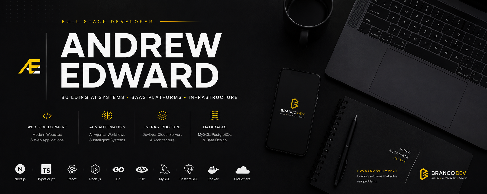

  

<h1 align="center">Hi, I'm Andrew Edward 👋</h1>

  <strong>Full Stack Developer • AI Systems • SaaS • Infrastructure</strong>

  Building scalable systems, AI-powered products and modern infrastructure.

---

## 🚀 What I Build

- 🤖 **AI Systems & Automation**
- ☁️ **SaaS Platforms**
- 🌐 **Web Applications**
- 🛠 **Infrastructure & DevOps**
- 🗄️ **Database Architecture**

---

## 🛠 Tech Stack

### Frontend

  
  
  
  
  

### Backend

  
  
  
  

### Infrastructure & DevOps

  
  
  
  

### Databases

  
  

---

## ⭐ Featured Project

### [InfraForge OS](https://github.com/goobzada/AndrewEdward)

**Autonomous AI Development Operating System**

A platform designed to orchestrate AI agents, infrastructure, databases, deployments and multiple technology stacks.
