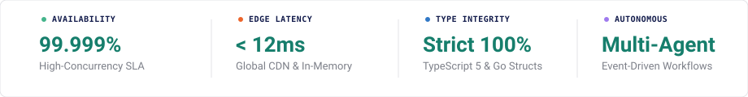
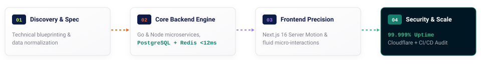

  

# Andrew Edward
### Principal Systems Architect &middot; Founder, [Branco Dev](https://brancodev.com)

*Engineering high-concurrency SaaS platforms, autonomous AI architectures, and modern cloud infrastructure.*

 

 

  

---

##  Executive Overview

<table>
  <tr>
    <td width="50%" valign="top">
       <strong>CONSULTANCY &amp; VENTURES</strong> 
      <a href="https://brancodev.com" target="_blank"><strong>BRANCO DEV</strong></a> &mdash; Custom SaaS Architectures &amp; Autonomous AI Systems for high-growth tech enterprises.
    </td>
    <td width="50%" valign="top">
       <strong>PRIMARY SERVICE HUBS</strong> 
      United States (Silicon Valley &middot; New York &middot; Austin &middot; Miami &middot; Seattle &middot; Boston) &amp; Global.
    </td>
  </tr>
  <tr>
    <td width="50%" valign="top">
       <strong>ENGINEERING CREED</strong> 
      <code>BUILD</code> &middot; <code>AUTOMATE</code> &middot; <code>SCALE</code>
    </td>
    <td width="50%" valign="top">
       <strong>SYSTEM STANDARDS</strong> 
      Strict 100% Type Safety &middot; Zero-Downtime Microservices &middot; Sub-12ms API Latency Targets.
    </td>
  </tr>
</table>

---

##  Core Engineering Specializations

<table>
  <tr>
    <td width="50%" valign="top">
      <h4> 01. Custom SaaS Platform Architecture</h4>
      
Multi-tenant architectures, automated Stripe/LemonSqueezy subscription billing engines, RBAC permission matrices, and high-concurrency background job processors.

    </td>
    <td width="50%" valign="top">
      <h4> 02. AI Systems, Agents &amp; Automations</h4>
      
Autonomous LLM multi-agent orchestration, RAG pipelines, custom vector embeddings, local model hosting (Ollama), and complex workflow automation (n8n, LangChain).

    </td>
  </tr>
  <tr>
    <td width="50%" valign="top">
      <h4> 03. High-Performance Web Applications</h4>
      
Modern frontend engineering utilizing Next.js 16 App Router, React 19 Server Components, Tailwind CSS design systems, and fluid editorial micro-interactions.

    </td>
    <td width="50%" valign="top">
      <h4> 04. Backend Microservices &amp; Databases</h4>
      
Resilient Go and Node.js backend services, normalized PostgreSQL/MySQL schemas, Redis in-memory caching tiers, and high-throughput REST/GraphQL/gRPC APIs.

    </td>
  </tr>
  <tr>
    <td width="50%" valign="top">
      <h4> 05. Cloud Infrastructure &amp; DevOps</h4>
      
Dockerized containerization, Kubernetes clusters, Cloudflare Edge routing & security, Linux server hardening, and automated GitHub Actions CI/CD pipelines.

    </td>
    <td width="50%" valign="top">
      <h4> 06. Security, Compliance &amp; Observability</h4>
      
End-to-end data encryption, JWT/OAuth2 authentication lifecycles, structured logging, distributed tracing, and automated vulnerability monitoring.

    </td>
  </tr>
</table>

---

##  Dynamic Engineering Arsenal &amp; Technical Capabilities

  

<table>
  <thead>
    <tr>
      <th align="left" width="22%">Engineering Domain</th>
      <th align="left" width="38%">Production Stack &amp; Tooling</th>
      <th align="left" width="40%">Core Capabilities &amp; Architecture</th>
    </tr>
  </thead>
  <tbody>
    <tr>
      <td>
         <strong>AI &amp; Multi-Agent</strong>
      </td>
      <td>
        
        
        
        
        
        
      </td>
      <td>Autonomous multi-agent orchestration, RAG semantic search, local LLM execution, dynamic model load balancing, and tool-calling loops.</td>
    </tr>
    <tr>
      <td>
         <strong>Frontend &amp; UI</strong>
      </td>
      <td>
        
        
        
        
        
        
      </td>
      <td>100/100 Core Web Vitals, React Server Components (RSC), bespoke design token systems, fluid micro-interactions, and canvas graphics.</td>
    </tr>
    <tr>
      <td>
         <strong>Backend &amp; Concurrency</strong>
      </td>
      <td>
        
        
        
        
        
        
      </td>
      <td>Sub-12ms API response targets, goroutine non-blocking pools, connection multiplexing, asynchronous queues, and type-safe contracts.</td>
    </tr>
    <tr>
      <td>
         <strong>Cloud &amp; DevOps</strong>
      </td>
      <td>
        
        
        
        
        
        
      </td>
      <td>Zero-downtime rolling deployments, multi-region failover, edge DDoS mitigation, hardened Linux VPS nodes, and automated CI/CD pipelines.</td>
    </tr>
    <tr>
      <td>
         <strong>Data &amp; In-Memory</strong>
      </td>
      <td>
        
        
        
        
        
        
      </td>
      <td>Third Normal Form (3NF) relational modeling, multi-tenant row partitioning, sub-millisecond Redis caching, and ACID transaction safety.</td>
    </tr>
  </tbody>
</table>

---

##  Production Case Studies

<table>
  <tr>
    <td width="50%" valign="top">
      <h3> 01 &mdash; InfraForge OS</h3>
      
<strong>Autonomous AI Development &amp; Infrastructure OS</strong>

      
Platform designed to orchestrate autonomous AI agents, infrastructure provisioning, multi-tenant databases, and CI/CD pipelines across multiple tech stacks.

      
<em>Tech: TypeScript, Go, Docker, PostgreSQL, Claude AI</em>

      

        
      

    </td>
    <td width="50%" valign="top">
      <h3> 02 &mdash; BillLaunch SaaS</h3>
      
<strong>Enterprise Billing &amp; Invoicing Engine</strong>

      
Multi-tenant automated billing, customer subscription management, and financial audit dashboard engineered for high-concurrency enterprise workflows ($2.4M+ volume).

      
<em>Tech: Next.js 16, TypeScript, PostgreSQL, Stripe Engine, Redis</em>

    </td>
  </tr>
  <tr>
    <td width="50%" valign="top">
      <h3> 03 &mdash; AeroLogistics AI</h3>
      
<strong>Real-Time Fleet &amp; Telematics Dispatch Engine</strong>

      
Autonomous logistics routing, dynamic telematics aggregation (1.8M events/sec), predictive scheduling, and real-time fleet coordination.

      
<em>Tech: Go (Golang), gRPC, WebSockets, PostGIS, Docker, Kafka</em>

    </td>
    <td width="50%" valign="top">
      <h3> 04 &mdash; ClientOps Portal</h3>
      
<strong>High-Traffic Enterprise Client Hub</strong>

      
High-throughput client management platform with zero-knowledge 256-bit AES encryption, real-time analytics, and automated SOC2/GDPR compliance pipelines.

      
<em>Tech: React 19, Node.js Microservices, Redis Caching, AWS S3</em>

    </td>
  </tr>
  <tr>
    <td colspan="2" valign="top">
      <h3> 05 &mdash; OmniRoute AI Gateway</h3>
      
<strong>Multi-LLM Load Balancer &amp; Intelligent Routing Engine</strong>

      
Unified enterprise AI gateway routing queries across 500+ models with dynamic failover, latency optimization (18ms TTFT), and semantic token caching.

      
<em>Tech: TypeScript, Python FastAPI, Redis Semantic Cache, Claude 3.5, OpenAI, Ollama</em>

      

        
      

    </td>
  </tr>
</table>

---

##  Delivery Lifecycle

  

---

##  Architecture Metrics

  
  
  
  

---

  <strong>Ready to engineer your next digital product?</strong> 
   <a href="https://brancodev.com" target="_blank"><strong>brancodev.com</strong></a> &middot;  <a href="mailto:grf87487@email.vccs.edu"><strong>grf87487@email.vccs.edu</strong></a>  
  <em>USA &amp; Global Consulting &middot; Full-Stack Engineering &middot; Custom SaaS &middot; Autonomous AI</em>

